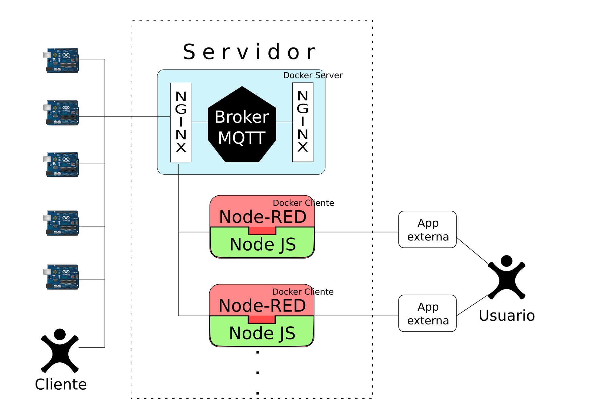

# Iot4Dummies

## Descripción

+ **Problema**

Con el auge de IoT y el crecimiento de la tecnología, las ideas para resolver problemas comunes utilizando ioT están en constante desarrollo, sin embargo la mayoría de estos proyectos, en Bogotá, no se pueden hacer realidad debido a una falta de infraestructura que permita mitigar los altos costos de hardware y la plataforma de software.

+ **¿Qué es IoT4Dummies?**

IoT4Dummies es una herramienta que busca proveer una solución a aquellas personas que desean trabajar con IoT pero tienen pocos conocimientos en el manejo de hardware y/o software necesario para llevar a cabo la solución que plantearon.
Para ello buscamos ofrecer una "interfaz" que el cliente consuma por medio de una herramienta de programación visual como Node-RED, que facilita las labores de codificación e interconexión entre nodos de hardware, evitando al cliente saber un lenguaje específico.

+ **Arquitectura del sistema**

## Cliente y Servidor

Para ver la documentación correspondiente a el cliente y el servidor, por favor ingresar a las carpetas respectivas y allí se encontrará la información necesaria.

## Licencia

**GNU GENERAL PUBLIC LICENSE**
Version 3, 29 June 2007

Copyright (C) 2007 Free Software Foundation, Inc. <http://fsf.org/>
Everyone is permitted to copy and distribute verbatim copies
of this license document, but changing it is not allowed.

## Origenes y fuentes

Los archivos gráficos tienen licencia Creative Commons 3.0, software principal como Node-RED y Nginx cuentan con licencia Apache 2.0 y BSD y las demás librerias y recursos son libres y compatibles dentro de la licencia GPL 3.0 establecida para este software.

